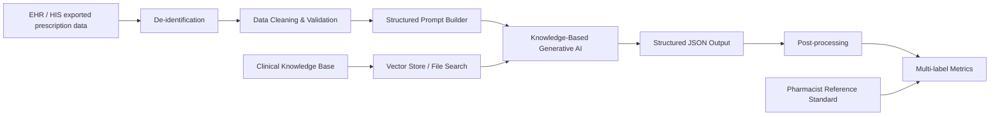

# System Architecture

## Components

1. **Data input**: de-identified prescription data from HIS/EHR.
2. **Knowledge base**: medication error definitions, taxonomy, medication list, local formulary.
3. **Vector store**: indexed knowledge files for file search retrieval.
4. **Inference engine**: OpenAI Responses API with strict system prompt and JSON output.
5. **Evaluation module**: compares AI output with pharmacist reference standard.
